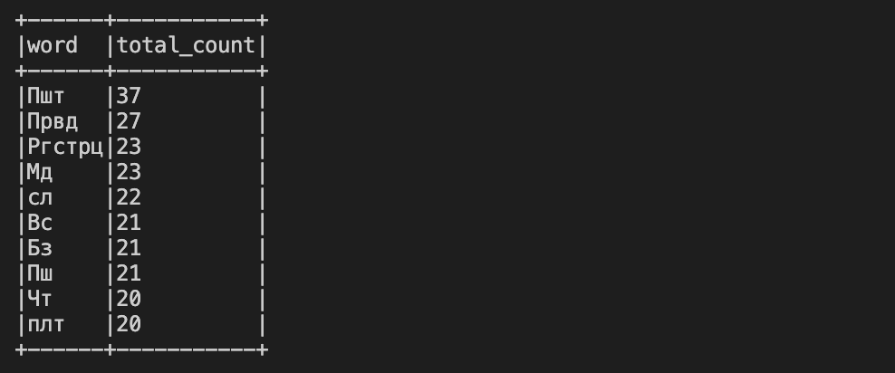

# Домашние задания по дисциплине 'Методы обработки больших данных'

## Домашнее задание 1. Spark RDD API

Запустить ноутбук:

```bash
jupyter notebook spark_hw1.ipynb
```

## Домашнее задание 2. Анализ поездок посредством Spark DataFrame API

Запустить ноутбук:

```bash
jupyter notebook spark_hw2.ipynb
```

## Домашнее задание 3. Обработка потоков данных посредством Spark Streaming

Запуск docker-compose для поднятия kafka:

```bash
docker-compose up -d
```

Запуск парсера:

```bash
python producer.py
python consumer.py
```

Результат парсинга


## Домашнее задание 4. Рекомендательные системы и Spark MLlib

Запустить ноутбук:

```bash
jupyter notebook spark_hw4.ipynb
```
